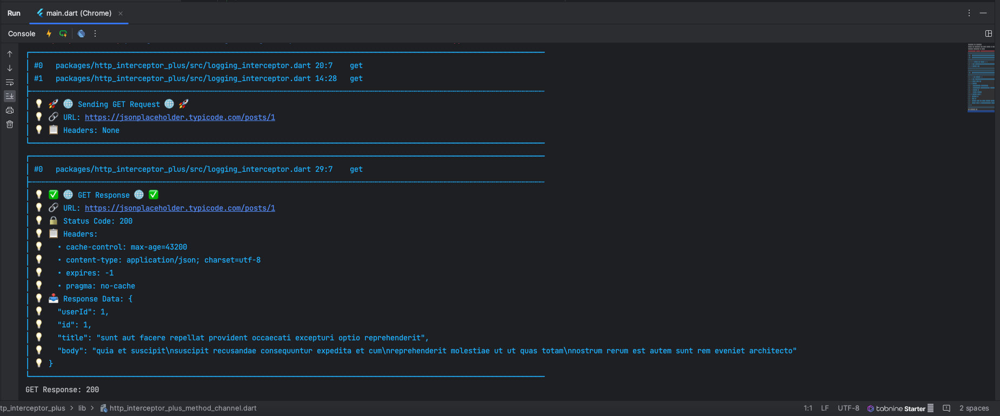

# http_interceptor_plus

HTTP Interceptor Plus is a Dart package that provides enhanced logging capabilities for HTTP requests and responses. It's designed to be used as a middleware for the `http` package.

## Table of Contents
- [Installation](#installation)
- [Why Use HTTP Interceptor Plus?](#why-use-http-interceptor-plus)
- [Features](#features)
- [Usage](#usage)
- [Example](#example)
- [Example Output](#example-output)
- [Contributing](#contributing)
- [License](#license)

## Installation

Add the following dependency to your `pubspec.yaml` file:

```yaml
dependencies:
  http_interceptor_plus: [latest_version]
```

And run:
```yaml
dart pub get
```

## Why Use HTTP Interceptor Plus?

- `Enhanced Logging:` Gain detailed insights into HTTP requests and responses.
- `Easy Integration:` Simply add it as middleware to your http.Client.
- `Flexible Configuration:` Customize logging levels and format.

## Features

- Log detailed information for GET, POST, PUT, PATCH, DELETE, and HEAD requests.
- Log request and response headers.
- Log request and response data.
- Works seamlessly with the standard http package.

## Usage

1. Import the necessary packages:

```dart 
import 'package:http/http.dart' as http;
import 'package:http_interceptor_plus/http_interceptor_plus.dart';
```

2. Create an instance of `LoggingMiddleware` and add it to your `http.Client`:

```dart 
final http.Client client = LoggingMiddleware(http.Client());
```

3. Use the `client` instance for making HTTP requests, and the logs will be automatically generated.

## Example

Here's a simple example demonstrating how to use HTTP Interceptor Plus:


```dart
import 'package:http/http.dart' as http;
import 'package:http_interceptor_plus/http_interceptor_plus.dart';

void main() async {
  final http.Client client = LoggingMiddleware(http.Client());

  // Make an HTTP GET request
  try {
    final response = await client.get(Uri.parse('https://jsonplaceholder.typicode.com/posts/1'));
    print('GET Response: ${response.statusCode}');
  } catch (e) {
    print('GET Error: $e');
  }

  // Add more examples for other HTTP methods here...
}
```

### Example Output

Below is an example illustrating the expected output when making an HTTP GET request using the provided `LoggingMiddleware`:



#### Explanation of Logs:

- **Request Details:**
    - **URL:** The URL of the HTTP request.
    - **Method:** The HTTP method used (GET in this example).
    - **Headers:** Request headers providing additional context.

- **Response Details:**
    - **URL:** The URL of the HTTP response.
    - **Status Code:** The HTTP status code indicating the outcome.
    - **Headers:** Response headers conveying additional information.
    - **Response Data:** The content of the response body.

These logs offer a clear and comprehensive overview of the request and response details, facilitating efficient debugging and analysis of your HTTP interactions.

*Note: The provided image is for illustrative purposes. Actual output may vary based on your specific use case and server responses.*

## Contributing

We welcome contributions! Feel free to open issues or submit pull requests.

## License

This package is distributed under the <a href="https://opensource.org/license/mit/">MIT License</a>. See <a href="https://pub.dev/packages/http_interceptor_plus/license">LICENSE</a> for details.
